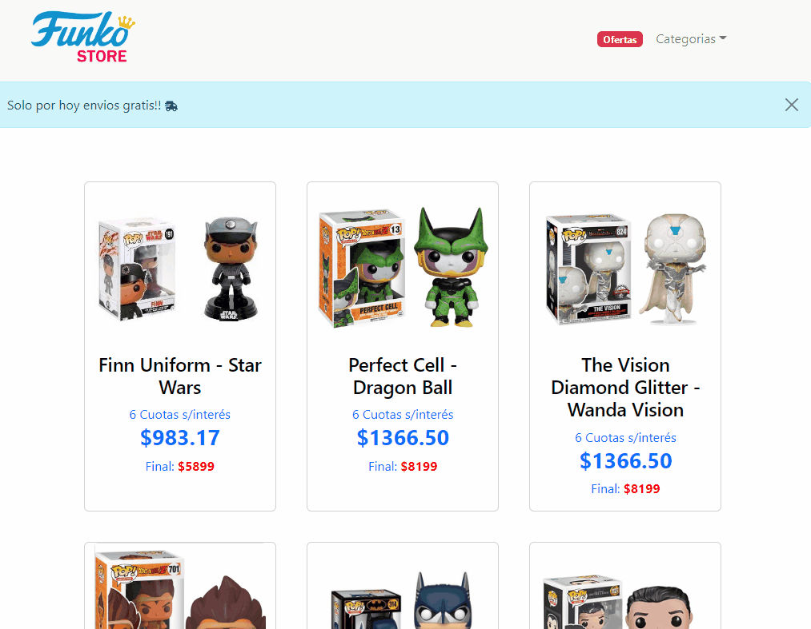

# Funko Store 🛒

*Proyecto de E-commerce desarrollado en ReactJs, para la plataforma CoderHouse 🚀* 

Estado: Finalizado. 🤞

[Demo en Netlify](https://react-ch-ecommerce.netlify.app/)

Librerias adicionales: 
React-bootstrap (https://react-bootstrap.github.io)
React-icons (https://react-icons.github.io/react-icons/)

Instalación:
Descargar proyecto
Luego dentro de la carpeta del proyecto ejecutar `npm install`

